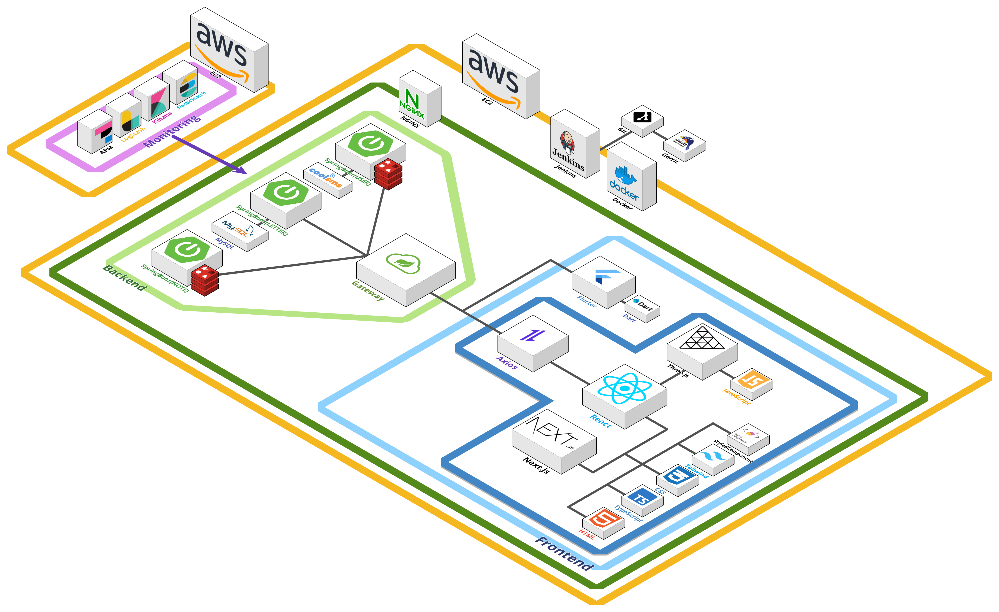
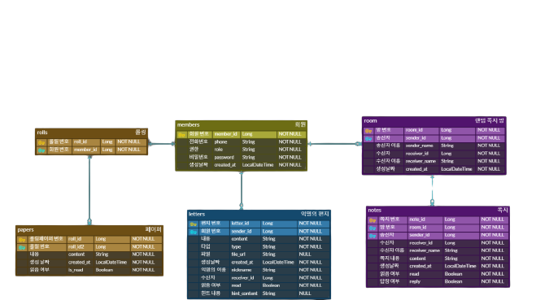
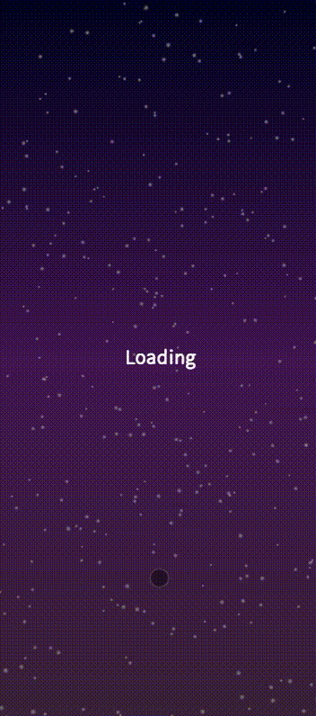
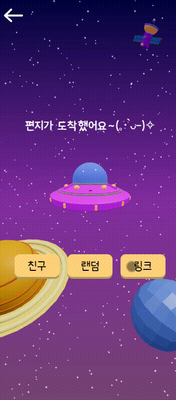

# ⭐ 23 # 별이삼샵 (SSAFY 9기 부울경 E106 취업못했는데 벌써 시벌)

<br/>

<div align=center>

<br/>
  

<div align="center">
  <h1>⭐ 23 #
  <h3>내 마음을 전달해주는 익명의 러브레터 💌
</h3>
</div>

<!-- <div align="right"><a href="https://(UCC링크)">🎥 UCC 보러 가기</a></div> -->
<br/>

## 📅 기간

- **2023.10.10 ~ 2023.11.17(7주)**

<a name="tableContents"></a>

<br/>

## 🔎 목차

1. <a href="#subject">🎯 기획 배경</a>
1. <a href="#mainContents">⭐️ 주요 기능</a>
1. <a href="#systemArchitecture">⚙️ 시스템 아키텍쳐</a>
1. <a href="#skills">🛠️ 기술 스택</a>
1. <a href="#directories">🗂️ 파일 구조</a>
1. <a href="#erd">💾 ERD</a>
1. <a href="#contents">🖥️ 화면 소개</a>
1. <a href="#developers">👥 팀원 소개</a>
1. <a href="#divisionOfDuties">💡 업무</a>

<br/>

<!------- 주제 시작 -------->

## 🎯 기획 배경

<a name="subject"></a>

**별이삼샵**

<b> 기획배경 </b>
<br/>
기억나니 그때 그 시절..?
전하지 못한 진심을 익명의 힘을 담아 전달할 수 있는 익명 편지 전달 플랫폼

<!------- 주요 기능 시작 -------->

## ⭐️ 주요 기능

<a name="mainContents"></a>

### 다른 사람에게 익명의 편지 보내기

- 다른 사람의 전화번호를 불러온다.
- 전화번호를 입력하고 내용을 쓰면 익명의 편지를 보낼 수 있다.
- 편지에 나에 대한 힌트를 담아서 보낼 수 있다.

<h4>모바일 : 플러터를 사용해서 전화번호 목록을 불러오고 서비스 사용자만 추려서 제공해준다.</h4>
<h4>웹 : 직접 전화번호를 입력한다.</h4>

---

### 랜덤 쪽지 보내기

- 본인을 제외한 사람들 중 랜덤으로 선정해서 쪽지를 보낸다.
- 닉네임은 형용사 + 동물 명사로 랜덤 난수 로직을 적용한다.

---

### 우주 롤링페이퍼

- 본인의 우주 롤링페이퍼 링크를 생성한다.
- 생성된 링크는 회원, 비회원 모든 사람에게 링크 공유 및 카카오 공유가 가능하다.
- 모든 사람은 우주 롤링페이퍼에서 우주인 캐릭터를 선택하고 익명의 글귀를 남길 수 있다.

<div align="right"><a href="#tableContents">목차로 이동</a></div>
<br/>

<!------- 시스템 아키텍쳐 시작 -------->

## ⚙️ 시스템 아키텍쳐

<a name="systemArchitecture"></a>



<div align="right"><a href="#tableContents">목차로 이동</a></div>
<br/>

<!------- 기술 스택 시작 -------->

## 🛠️ 기술 스택

<a name="skills"></a>

<!-- -(색깔)?style=for-the-badge&logo=(이름)&logoColor=white>) -->

### 프론트

  
  
 


 


---

### 백엔드

    

   
   

 

---

### 협업

   


<div align="right"><a href="#tableContents">목차로 이동</a></div>

<br/>

<!------- 파일 구조 시작 -------->

## 🗂️ 파일 구조

<a name="directories"></a>

### 프론트

<details align="left">
  <summary>
    자세히
  </summary>

```
📦front
 ┣ 📂node_modules
 ┣ 📂public
 ┃ ┣ 📂assets
 ┃ ┃ ┣ 📂astronaut
 ┃ ┃ ┣ 📂character
 ┃ ┃ ┣ 📂glb
 ┃ ┃ ┗ 📂📂planet
 ┃ ┣ 📂fonts
 ┃ ┣ 📂icons
 ┃ ┃ ┗ 📂📂planets
 ┃ ┣ 📂link
 ┃ ┣ 📂main
 ┃ ┣ 📂write
 ┣ 📂src
 ┃ ┣ 📂app
 ┃ ┃ ┣ 📂auth
 ┃ ┃ ┃ ┣ 📂loginPassword
 ┃ ┃ ┃ ┣ 📂regist
 ┃ ┃ ┃ ┗ 📂registpass
 ┃ ┃ ┣ 📂error
 ┃ ┃ ┣ 📂main
 ┃ ┃ ┣ 📂pullfriend
 ┃ ┃ ┣ 📂storage
 ┃ ┃ ┃ ┣ 📂friend
 ┃ ┃ ┃ ┃ ┗ 📂[letter]
 ┃ ┃ ┃ ┣ 📂random
 ┃ ┃ ┃ ┃ ┣ 📂[history]
 ┃ ┃ ┃ ┃ ┃ ┗ 📂[reply]
 ┃ ┃ ┣ 📂today
 ┃ ┃ ┃ ┣ 📂arrive
 ┃ ┃ ┃ ┣ 📂delivery
 ┃ ┃ ┃ ┗ 📂storage
 ┃ ┃ ┃ ┃ ┣ 📂friend
 ┃ ┃ ┃ ┃ ┣ 📂Link
 ┃ ┃ ┃ ┃ ┃ ┗ 📂[slug]
 ┃ ┃ ┃ ┃ ┃ ┃ ┣ 📂write
 ┃ ┃ ┃ ┃ ┃ ┃ ┗ 📂[id]
 ┃ ┃ ┃ ┃ ┗ 📂Random
 ┃ ┃ ┣ 📂types
 ┃ ┃ ┃ ┗ 📂storage
 ┃ ┃ ┣ 📂utils
 ┃ ┃ ┃ ┣ 📂main
 ┃ ┃ ┃ ┣ 📂sms
 ┃ ┃ ┃ ┣ 📂storage
 ┃ ┃ ┃ ┣ 📂todayStorage
 ┃ ┃ ┃ ┃ ┣ 📂friend
 ┃ ┃ ┃ ┃ ┣ 📂link
 ┃ ┃ ┃ ┃ ┗ 📂random
 ┃ ┃ ┃ ┗ 📂write
 ┃ ┃ ┗ 📂write
 ┃ ┃ ┃ ┣ 📂send
 ┃ ┃ ┃ ┃ ┗ 📂component
 ┃ ┃ ┃ ┣ 📂wfriend
 ┃ ┃ ┃ ┃ ┣ 📂getfriend
 ┃ ┃ ┃ ┃ ┣ 📂input
 ┃ ┃ ┃ ┃ ┗ 📂searchfriend
 ┃ ┃ ┃ ┗ 📂wrandom
 ┃ ┣ 📂component
 ┃ ┃ ┣ 📂arrive
 ┃ ┃ ┣ 📂axes
 ┃ ┃ ┣ 📂common
 ┃ ┃ ┃ ┣ 📂kakaoShareButton
 ┃ ┃ ┃ ┗ 📂write_layout
 ┃ ┃ ┣ 📂login
 ┃ ┃ ┣ 📂main
 ┃ ┃ ┣ 📂storage
 ┃ ┃ ┃ ┣ 📂friend
 ┃ ┃ ┃ ┗ 📂random
 ┃ ┃ ┣ 📂Three
 ┃ ┃ ┣ 📂today
 ┃ ┃ ┃ ┗ 📂todayStorage
 ┃ ┃ ┃ ┃ ┣ 📂checkPosition
 ┃ ┃ ┃ ┃ ┣ 📂friend
 ┃ ┃ ┃ ┃ ┃ ┗ 📂astronautModel
 ┃ ┃ ┃ ┃ ┣ 📂light
 ┃ ┃ ┃ ┃ ┣ 📂link
 ┃ ┃ ┃ ┃ ┃ ┣ 📂astronautModel
 ┃ ┃ ┃ ┃ ┃ ┣ 📂planetModel
 ┃ ┃ ┃ ┃ ┃ ┣ 📂shareButton
 ┃ ┃ ┃ ┃ ┃ ┣ 📂ufoModel
 ┃ ┃ ┃ ┃ ┃ ┗ 📂writeButton
 ┃ ┃ ┃ ┃ ┗ 📂random
 ┃ ┃ ┃ ┃ ┃ ┣ 📂planetModel
 ┃ ┃ ┃ ┃ ┃ ┣ 📂randomPlanet
 ┃ ┃ ┃ ┃ ┃ ┗ 📂rocketModel
 ┃ ┃ ┗ 📂write
 ┃ ┗ 📂store
 ┣ 📜.gitignore
 ┣ 📜.env
 ┣ 📜.eslintrc.json
 ┣ 📜.prettierrc
 ┣ 📜Dockerfile
 ┣ 📜next.config.js
 ┣ 📜next-env.d.ts
 ┣ 📜package-lock.json
 ┣ 📜postcss.config.js
 ┣ 📜README.md
 ┣ 📜tailwind.config.js
 ┣ 📜yarn.lock
 ┗ 📜tsconfig.json
```

</details>

### 백엔드

<details align="left">
  <summary>
    자세히
  </summary>

```
📦back
 ┣ 📂eureka
 ┃ ┣ 📂gradle
 ┃ ┣ 📂src
 ┃ ┃ ┣ 📂main
 ┃ ┃ ┃ ┗ 📂java
 ┃ ┃ ┃ ┃ ┗ 📂com
 ┃ ┃ ┃ ┃ ┃ ┗ 📂eureka
 ┃ ┃ ┃ ┃ ┃ ┃ ┗ 📂eureka
 ┃ ┃ ┃ ┃ ┃ ┃ ┃ ┣ 📂elasticsearch
 ┃ ┃ ┃ ┃ ┃ ┃ ┃ ┣ 📂emotion
 ┃ ┃ ┃ ┃ ┃ ┃ ┃ ┣ 📂exception
 ┃ ┃ ┃ ┃ ┃ ┃ ┃ ┣ 📂jwt
 ┃ ┃ ┃ ┃ ┃ ┃ ┃ ┣ 📂kafka
 ┃ ┃ ┃ ┃ ┃ ┃ ┃ ┣ 📂member
 ┃ ┃ ┃ ┃ ┃ ┃ ┃ ┣ 📂recommend
 ┃ ┃ ┃ ┃ ┃ ┃ ┃ ┣ 📂response
 ┃ ┃ ┃ ┃ ┃ ┃ ┃ ┣ 📂search
 ┃ ┃ ┃ ┃ ┃ ┃ ┃ ┣ 📂statistic
 ┃ ┃ ┃ ┃ ┃ ┃ ┃ ┣ 📂swagger
 ┃ ┃ ┃ ┃ ┃ ┃ ┃ ┗ 📂transaction
 ┃ ┃ ┗ 📂test
 ┣ 📂gateway
 ┃ ┣ 📂gradle
 ┃ ┣ 📂src
 ┃ ┃ ┣ 📂main
 ┃ ┃ ┃ ┗ 📂java
 ┃ ┃ ┃ ┃ ┗ 📂com
 ┃ ┃ ┃ ┃ ┃ ┗ 📂letter
 ┃ ┃ ┃ ┃ ┃ ┃ ┗ 📂gateway
 ┃ ┃ ┃ ┃ ┃ ┃ ┃ ┣ 📂config
 ┃ ┃ ┗ 📂test
 ┣ 📂auth-service
 ┃ ┣ 📂gradle
 ┃ ┣ 📂src
 ┃ ┃ ┣ 📂main
 ┃ ┃ ┃ ┗ 📂java
 ┃ ┃ ┃ ┃ ┗ 📂com
 ┃ ┃ ┃ ┃ ┃ ┗ 📂letter
 ┃ ┃ ┃ ┃ ┃ ┃ ┗ 📂auth-service
 ┃ ┃ ┃ ┃ ┃ ┃ ┃ ┣ 📂emotion
 ┃ ┃ ┃ ┃ ┃ ┃ ┃ ┣ 📂exception
 ┃ ┃ ┃ ┃ ┃ ┃ ┃ ┣ 📂jwt
 ┃ ┃ ┃ ┃ ┃ ┃ ┃ ┣ 📂config
 ┃ ┃ ┃ ┃ ┃ ┃ ┃ ┣ 📂member
 ┃ ┃ ┗ 📂test
 ┣ 📂letter-service
 ┃ ┣ 📂gradle
 ┃ ┣ 📂src
 ┃ ┃ ┣ 📂main
 ┃ ┃ ┃ ┗ 📂java
 ┃ ┃ ┃ ┃ ┗ 📂com
 ┃ ┃ ┃ ┃ ┃ ┗ 📂letter
 ┃ ┃ ┃ ┃ ┃ ┃ ┗ 📂letter-service
 ┃ ┃ ┃ ┃ ┃ ┃ ┃ ┣ 📂emotion
 ┃ ┃ ┃ ┃ ┃ ┃ ┃ ┣ 📂exception
 ┃ ┃ ┃ ┃ ┃ ┃ ┃ ┣ 📂letter
 ┃ ┃ ┃ ┃ ┃ ┃ ┃ ┣ 📂config
 ┃ ┃ ┗ 📂test
 ┣ 📂note-service
 ┃ ┣ 📂gradle
 ┃ ┣ 📂src
 ┃ ┃ ┣ 📂main
 ┃ ┃ ┃ ┗ 📂java
 ┃ ┃ ┃ ┃ ┗ 📂com
 ┃ ┃ ┃ ┃ ┃ ┗ 📂letter
 ┃ ┃ ┃ ┃ ┃ ┃ ┗ 📂note-service
 ┃ ┃ ┃ ┃ ┃ ┃ ┃ ┣ 📂emotion
 ┃ ┃ ┃ ┃ ┃ ┃ ┃ ┣ 📂exception
 ┃ ┃ ┃ ┃ ┃ ┃ ┃ ┣ 📂note
 ┃ ┃ ┃ ┃ ┃ ┃ ┃ ┣ 📂config
 ┃ ┃ ┗ 📂test
📂elastic
 ┣ 📂elasticsearch
 ┃ ┣ 📂data
 ┃ ┃ ┗ 📂nodes
 ┣ 📂kibana
 ┣ 📂logstash
 ┃ ┣ 📂drivers
 ┃ ┣ 📂pipeline
 ┗ 📜docker-compose-elastic.yml
 📂conf
 ┗ nginx.config
📜docker-compose.yml
📜docker-compose-nginx.yml
```

</details>

<div align="right"><a href="#tableContents">목차로 이동</a></div>

<br/>

<!------- ERD 시작 -------->

## 💾 ERD

<a name="erd"></a>



<div align="right"><a href="#tableContents">목차로 이동</a></div>

<br/>

<!------- 화면 소개 시작 -------->

<a name="contents"></a>

<br/>

## 🖥️ 화면 소개

### 1. 로그인 페이지

<div align=center>

</div>

### 2. 메인 페이지

<div align=center>

</div>

### 3. 편지작성 페이지

<div align=center>


</div>

### 4. 카카오톡 링크전송

<div align=center>

</div>

### 5. 보관함

<div align=center>


</div>

### 6. 오늘 온 편지함

<div align=center>



</div>

## 🖥️ 기술

### 1. Spring Cloud MSA

<div align=center>

</div>

### 2. Elastic Stack 모니터링

<div align=center>

</div>

### 3. Three.js를 이용한 인터렉티브한 화면

</div>

<div align=center>


</div>
<br/>

<br/>
<!------- 팀원 소개 시작 -------->

## 👥 팀원 소개

<a name="developers"></a>

|   **Name**   |                조병철                |                 권은정                 |                 김예슬                  |                 조은정                 |                                      이승민                                       |                 최진석                 |
| :----------: | :----------------------------------: | :------------------------------------: | :-------------------------------------: | :------------------------------------: | :-------------------------------------------------------------------------------: | :------------------------------------: |
| **Profile**  |  |    |     |    |                                               |    |
| **Position** |        Leader <br/> Frontend         |                Frontend                |                Frontend                 |                Frontend                |                                      Backend                                      |                Backend                 |
|   **Git**    | [GitHub](https://github.com/bbang7)  | [GitHub](https://github.com/jjeoungS2) | [GitHub](https://github.com/yeseul0722) | [GitHub](https://github.com/jeunjeong) | [GitHub](https://github.com/SMin1620) <br/> [Blog](https://smin1620.tistory.com/) | [GitHub](https://github.com/choiapple) |

<div align="right"><a href="#tableContents">목차로 이동</a></div>

<!------- 업무 분장 시작 -------->

## 💡 업무 분장

<a name="divisionOfDuties"></a>

#### FrontEnd

- **조병철** :
  <br/>기획 단계 팀원 의견 조율
  <br/>프론트엔트 협업 툴 적응 보조
  <br/>프론트엔드 git 관리
  <br/>사용자 메시지 보관함 (친구/랜덤) 페이지 작성 및 기능구현
  <br/>JWT토큰 적용된 http 통신 컴포넌트 작성
- **권은정** :
  <br/>로그인
  <br/>회원가입
  <br/>메인페이지
  <br/>전송중, 전송완료 페이지
- **김예슬** :
  <br/>three.js를 이용한 오늘의 보관함 페이지
  <br/>롤링페이퍼 url 복사 및 카카오톡 공유 기능
  <br/>롤링페이퍼 작성 및 읽기 기능 구현
- **조은정** :
  <br/>글 작성 페이지 제작
  <br/>flutter를 이용한 인앱웹뷰 apk 형태 제공
  <br/>

#### BackEnd

- **이승민** : spring boot api 개발, Spring Cloud MSA 백엔드 서버 구축, ELk Stack을 활용한 MSA 서버 모니터링 구축
- **최진석** : spring boot api 개발, CoolSMS 문자, CI/CD

<div align="right"><a href="#tableContents">목차로 이동</a></div>
